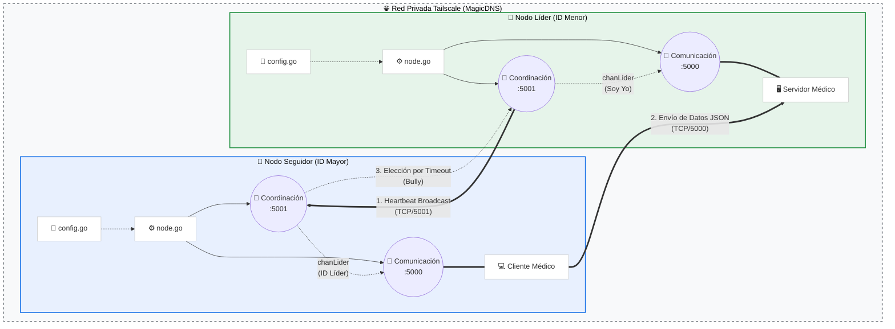

# Arquitectura del Sistema: Nodos de Monitoreo Médico

Este diagrama describe la arquitectura interna de un nodo y cómo interactúan múltiples instancias dentro de la **Tailnet**.

## Descripción de Componentes

1.  **Capa de Orquestación (`node.go`):** Inicializa el nodo, valida que el hostname `hospital-ID` sea único en la red y lanza los servicios concurrentes.
2.  **Módulo de Coordinación:**
    - Implementa el algoritmo de Bully. 
    - El **Líder** notifica su presencia mediante latidos constantes al puerto `5001`.
    - El **Seguidor** vigila el `ElectionTimeout`. Si se agota, escanea a los nodos con ID menor.
3.  **Módulo de Comunicación:** 
    - Utiliza un canal (`chanLider`) para recibir actualizaciones de estado.
    - Si es seguidor, actúa como cliente enviando JSON al puerto `5000`.
    - Si es líder, activa el servidor de recepción de datos.