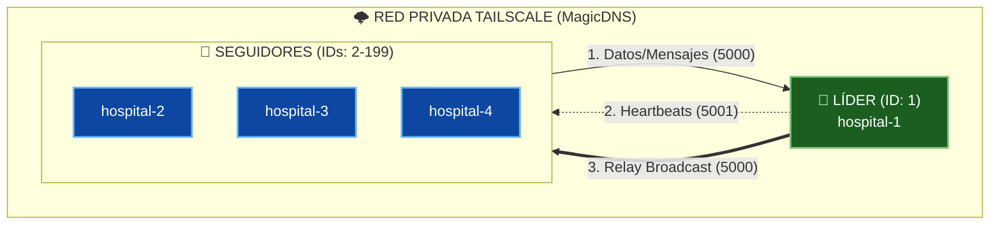
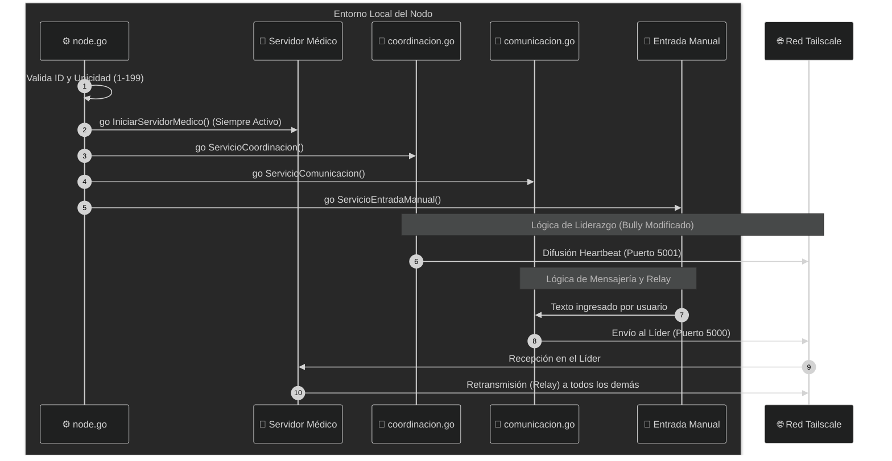
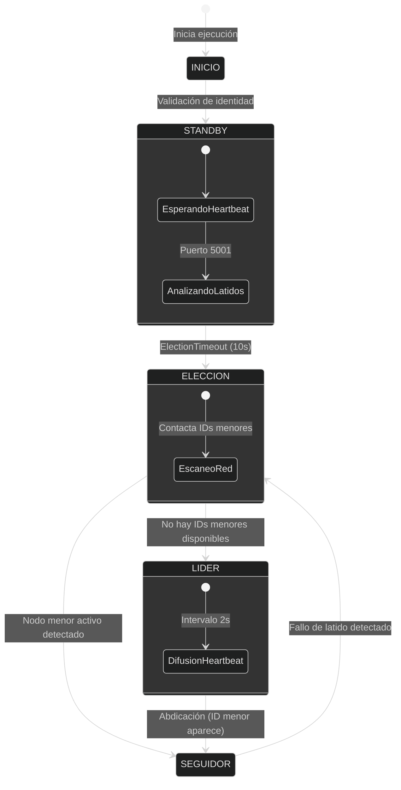

# Arquitectura del Sistema: Nodos de Monitoreo Médico

Este documento detalla la infraestructura distribuida y la lógica interna de los nodos que operan sobre la red privada **Tailscale**.

## 1. Topología de Red (Vista Externa)
Esta vista representa la interacción entre los 4 nodos del laboratorio distribuidos en la **SD-WAN**.

```mermaid

flowchart LR
    subgraph TailscaleCloud ["🌩️ RED PRIVADA TAILSCALE (MagicDNS)"]
        direction LR
        
        subgraph Seguid ["🏥 SEGUIDORES (IDs: 2-199)"]
            direction TB
            Node2["hospital-2"]
            Node3["hospital-3"]
            Node4["hospital-4"]
        end

        Leader["👑 LÍDER (ID: 1)<br/>hospital-1"]

        %% Flujo de datos y control
        Seguid -- "1. Datos/Mensajes (5000)" --> Leader
        Leader -. "2. Heartbeats (5001)" .-> Seguid
        Leader == "3. Relay Broadcast (5000)" ==> Seguid
    end

    %% Definición de estilos (Obligatorio para que funcionen las clases)
    classDef leader fill:#1b5e20,stroke:#81c784,stroke-width:2px,color:#ffffff;
    classDef follower fill:#0d47a1,stroke:#64b5f6,stroke-width:2px,color:#ffffff;

    class Leader leader;
    class Node2,Node3,Node4 follower;
```

## 2. Flujo de Ejecución e Inter-comunicación (Goroutines)
Describe cómo el punto de entrada `node.go` orquesta los módulos internos y utiliza canales para sincronizar el estado del liderazgo[cite: 9, 10].

```mermaid
%%{init: {'theme': 'dark'}}%%
sequenceDiagram
    autonumber
    box rgb(40, 40, 40) Entorno Local del Nodo
        participant Main as ⚙️ node.go
        participant Server as 🏥 Servidor Médico
        participant Coord as 🔄 coordinacion.go
        participant Comm as 📡 comunicacion.go
        participant Input as 💬 Entrada Manual
    end
    participant Red as 🌐 Red Tailscale

    Main->>Main: Valida ID y Unicidad (1-199)
    Main->>Server: go IniciarServidorMedico() (Siempre Activo)
    Main->>Coord: go ServicioCoordinacion()
    Main->>Comm: go ServicioComunicacion()
    Main->>Input: go ServicioEntradaManual()

    Note over Coord, Red: Lógica de Liderazgo (Bully Modificado)
    Coord->>Red: Difusión Heartbeat (Puerto 5001)

    Note over Input, Comm: Lógica de Mensajería y Relay
    Input->>Comm: Texto ingresado por usuario
    Comm->>Red: Envío al Líder (Puerto 5000)
    Red->>Server: Recepción en el Líder
    Server->>Red: Retransmisión (Relay) a todos los demás
```

## 3. Lógica del Algoritmo de Elección (Estados)
Representa el ciclo de vida del nodo y las condiciones de transición basadas en el algoritmo de **Bully modificado**.

```mermaid
%%{init: {'theme': 'dark'}}%%
stateDiagram-v2
    [*] --> INICIO: Inicia ejecución
    INICIO --> STANDBY: Validación de identidad
    
    state STANDBY {
        [*] --> EsperandoHeartbeat
        EsperandoHeartbeat --> AnalizandoLatidos: Puerto 5001
    }
    
    STANDBY --> ELECCION: ElectionTimeout (10s)
    
    state ELECCION {
        [*] --> EscaneoRed: Contacta IDs menores
    }
    
    ELECCION --> SEGUIDOR: Nodo menor activo detectado
    ELECCION --> LIDER: No hay IDs menores disponibles
    
    state LIDER {
        [*] --> DifusionHeartbeat: Intervalo 2s
    }
    
    LIDER --> SEGUIDOR: Abdicación (ID menor aparece)
    SEGUIDOR --> ELECCION: Fallo de latido detectado
```

---

### Notas Técnicas Adicionales
*   **Concurrencia:** El uso de Goroutines independientes permite que la detección de fallos (coordinación) no bloquee la recolección de signos vitales (comunicación).
*   **Seguridad:** Toda la comunicación ocurre dentro de la interfaz virtual de Tailscale, utilizando **MagicDNS** para la resolución de hostnames dinámicos.
*   **Timeouts:** El `ElectionTimeout` está configurado en **10 segundos** para tolerar latencias en la red SD-WAN.